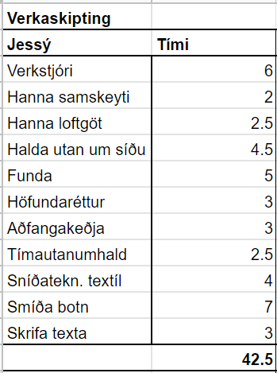
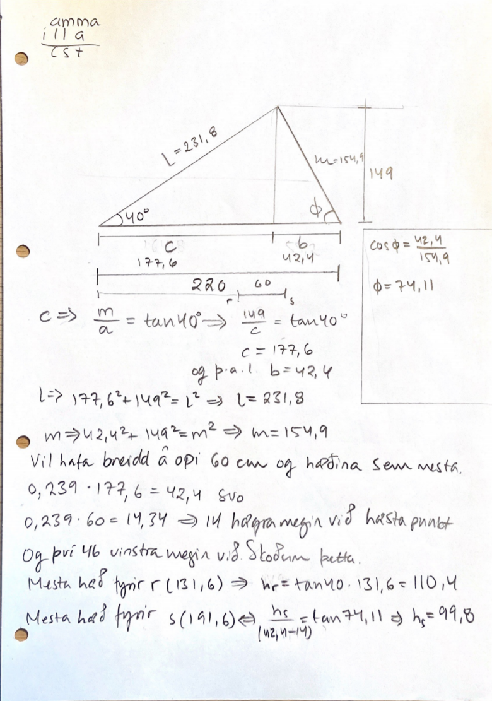
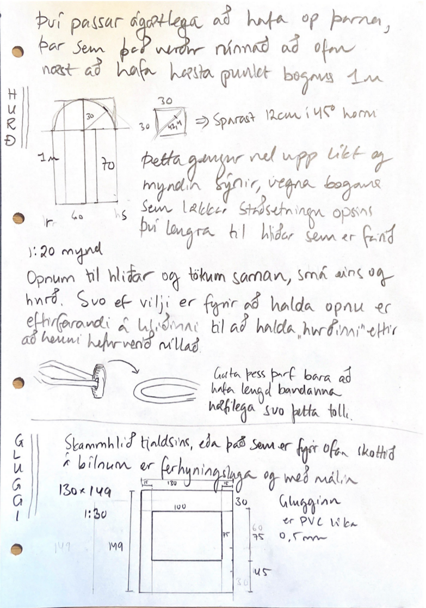
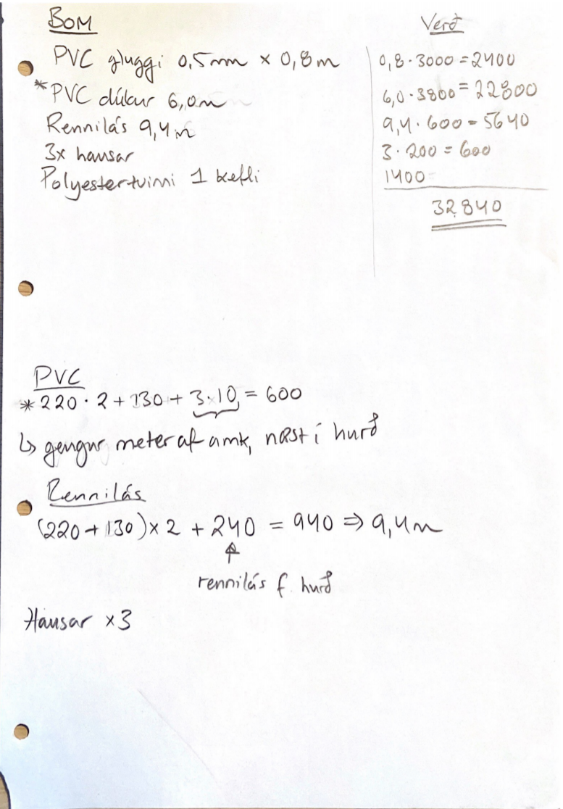

Lokaverkefni
### Lokaverkefni: topptjald - Tindaból 

Við ákváðum að gera lokaverkefni sem myndi nýtast hópmeðlimum vel. Varð því topptjald fyrir valinu þar sem slíkt kostar um 400.000 þúsund plús keypt. 
Hér má sjá heimasíðu verkefnisins: https://sites.google.com/view/tindabol/heim?authuser=1.

Hér er svo mitt tímaframlag til verkefnisins:

Mitt hlutverk var aðallega í því að sjá til þess að verkefnið væri á réttu róli sem og hafði yfirumsjón með dúknum þar sem ég vann í vefnaðarvöruverslun í þó nokkur ár. Hér er samantekt af skönnuðum teikningum af skipulagi tengt dúknum og sniði og málum.

