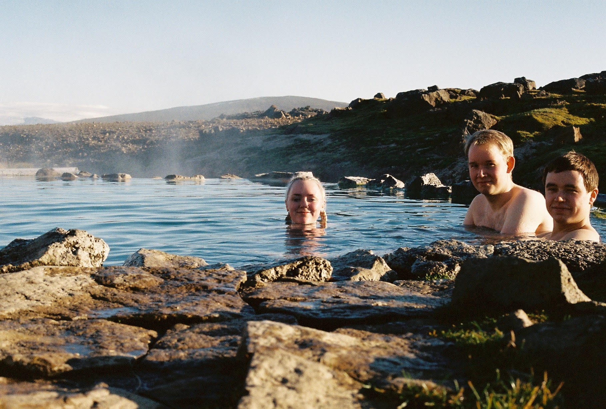

### Þjáningafélagið
Teymið hefur komið saman áður í öðrum verkefnum, eftir að hafa kynnst á fyrsta ári í tölvuteikningu. Þá gerði félagið lokaverkefni saman og hannaði kerru fyrir bíl og sló þar með tóninn fyrir öll frekari samvinnuverkefni félagsins: of metnaðarfullt, án tillits til verklýsingar, of tímafrekt en alltaf til mikillar ánægju. Í Þjáningarfélaginu eru þrír stjórnarmenn - þó stundum séu aðrir félagsmenn, svosem Ási og Guðrún.

Ívar Dór er 23 ára gamall forystusauður úr óbyggðum, þ.e.a.s. úr Kórahverfinu við Bláfjallarætur. Hann kláraði Menntaskólann við Hamrahlíð um jólin 2016 og tók sér mánuð í Tækniskólanum, á braut sem hann sjálfur kallar „Föndur og útklippibraut“. Svo lá leiðin í verkfræði, eftir áeggjan Jessýjar. Það vorið vorum við nefnilega frumkvöðlar, raunar ekki nema í eins og tvo mánuði. Þá ætluðum við í framleiðslu á hljóðdempandi römmum - Dempa ehf, náttúrulega. Ívar hefur ýmis áhugamál, svosem Toyotur og fjallamennsku, en þó ekkert eins og að setja metnað í röngu hlutina.

Kjartan Magnússon er hálffimmtugur forystusauður, og sennilega áttræður í anda. Hann flúði Menntaskólann í Reykjavík árið 2014. Við getum svosem ekki verið viss um hvor hljóp undan hverjum. En það gildir engu - hann sá ljósið. Hann tók sér akademískt korter, fjarri menntastofnunum, áður en leið hans lá í Fjölbrautaskólann við Ármúla þar sem hann lauk stúdentsprófi jólin 2016 eftir að hafa lokið ígildi stærðfræði 203 þrisvar sinnum og allri jarðfræði sem kennd er á fyrsta ári í HÍ tvisvar. Deginum ljósara er að maðurinn er sprenglærður, þó það heyrist illa í samræðum. Áhugasvið Kjartans er á nálægri bylgjulengd við Ívars, enda eyða þeir ómældum tíma saman. Hjónabandið er ekki alltaf farsælt, enda er það sjaldnast svo, en þeir þvertaka fyrir að fara í ráðgjöf. Þess fyrir utan hefur hann ástríðu fyrir diskódanstónlist og má ekki heyra hana án þess að stökkva upp í dans. 

Jessý Jónsdóttir er 23 ára forystusauður og á að baki sér glæstan feril í félagsstörfum nær og fjær, þrátt fyrir ungan aldur. Hún hefur alltaf sett náungann í fyrsta sæti og byrjaði á formennsku í nemendaráði Kelduskóla, Vík. Ekki gefst pláss á blaði til að telja upp frekari afrek í Jessýjar í félagsstörfum. Hún hóf nám í iðnaðarverkfræði 2017 eftir aukaár eftir útskrift í Menntaskólanum við Hamrahlíð, að eigin sögn vegna þess hve gaman var í skólanum. Þessi ástríða fyrir akademísku erfiði varð eftir í Hamrahlíð og hefur hún reynt eftir fremsta megni að sóa tíma við áframhaldandi félagsstörf í Háskóla Íslands, t.d. sem forseti nemendafélags véla-, iðnaðar- og efnaverkfræðinema og frambjóðandi í stúdentaráð. Helsti áhugi Jessýjar er vinnan og hún tekur máltækinu “vinnan göfgar manninn” helst til alvarlega. Þess utan nýtur hún útivistar með vinum sínum, sem reyna að draga hana á fjöll við öll tækifæri. Hún er handlagin og með ágætt verkvit, þótt hún sé vonlaus í landafræði og geti ekki sagt þér hvar Húsafell er.

Að framansögðu er það skýrt að þegar þrír forystusauðir koma saman, eiga hornin það til að nuddast ærlega saman. Afrakstur þess er jafnan tær snilld, hvort sem það er gott ferðalag eða góð hönnun.

