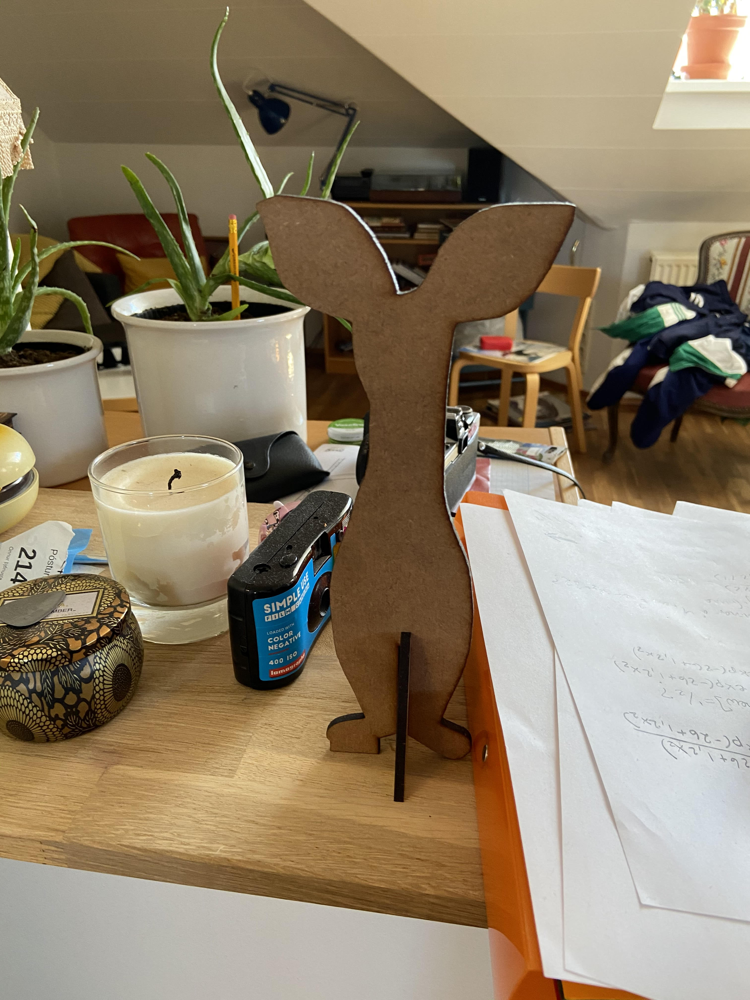
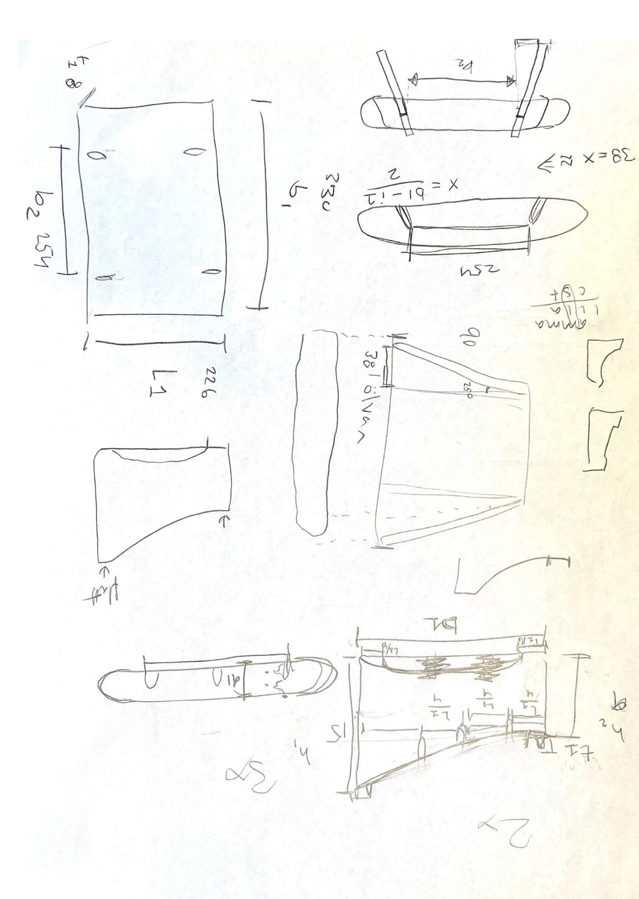
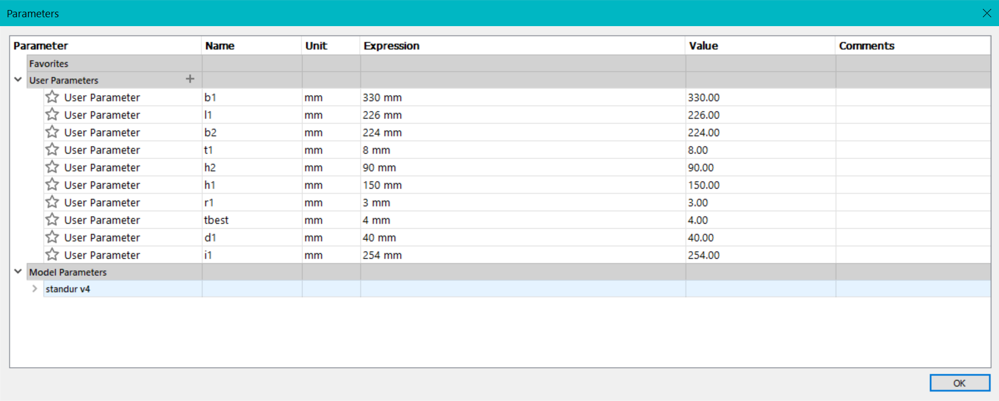
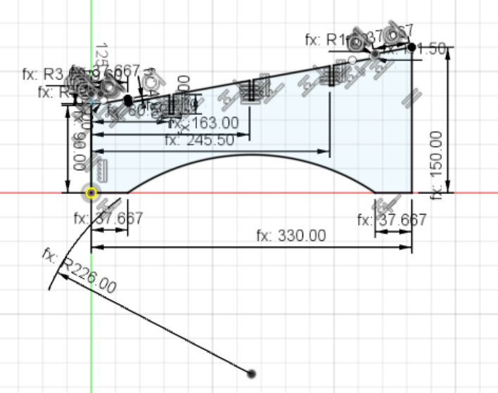
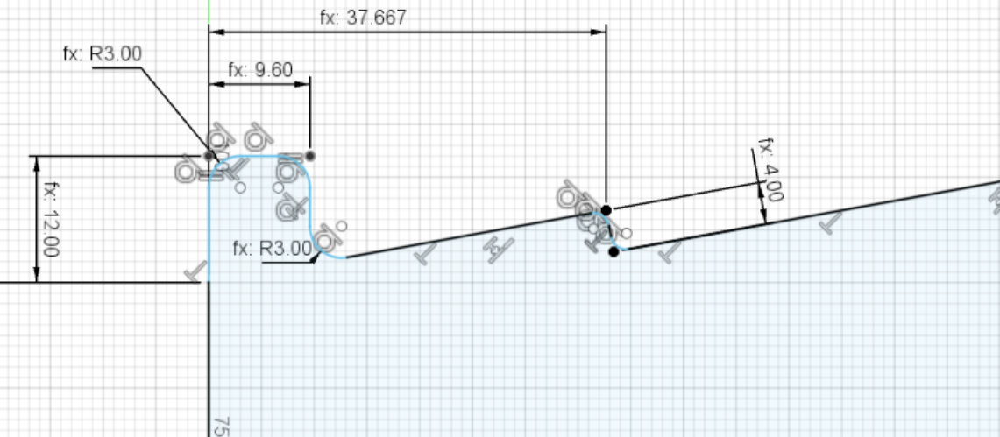
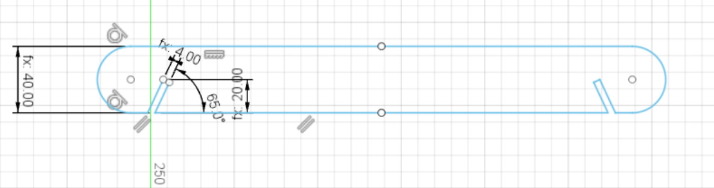

## Verkefni 2: Leiserskurður
Hugmyndavinna:
Ég ætlaði fyrst að gera Snabba úr múmínálfunum. Ég vissulega leiserskar hann, sem var gert í hálfgerðu hálfkáki mjög snemma á önninni. Ég reyndi að gera það í leiserskeranum á Smyrilsvegi en hann var nýbilaður þegar ég ætlaði að framkvæma verkefnið og þurfti því að fara í fablab. Til að gera langa sögu stutta var Snabbi alls ekkert parametrískur allur ... aftur á móti lærði ég loks á Fusion en ég hafði aldrei nýtt mér það forrit í neinum mæli. Hér má sjá mynd af Snabba (óparametrískur) eftir leiserskurð.
 

 
Jæja. Þá voru góð ráð dýr! Ég fór að hugsa hvað mig langaði að gera sem er raunverulega parametrískt. Ívar vinur minn hafði nýverið gert tölvustand. Ég áttaði mig því á að mig vantaði slíkan líka. Ég er með aukaskjá til að vinna að heiman, hann er mjög stór og miklu hærri en fartölvan mín svo tölvuskjárinn á fartölvunni nýttist síður því ég forðaðist að nota hann. Ef ég notaði þá samtímis þurfti ég alltaf að færa höfuðið töluvert til því skjáirnir voru ansi langt frá því að vera í svipaðri augnhæð. Ég vildi því hafa styttri hluta standsins 9 cm og lengri (að aftan) 15 cm. 

Ég vildi því gera undir tölvuna. Gríðarlega hentugt var líka að gera slíkt parametrískt þar sem ég er með augun á nýjum tölvum og er með aðra vinnutölvu. Tilvalið í gjafir fyrir vini og vandamenn - sérsniðin lausn, þarf bara mál á tölvu viðkomandi. 

Ég lagðist því undir feld og hér má sjá fyrstu skissu af standinum:

Þá var mér ekkert að vanbúnaði en að fara að teikna í Fusion. 

Ég setti upp parametrana eins og má sjá hér:

Ég þurfti í raun bara að teikna tvo íhluti, þ.e. hliðina (2x) og þverstífu (3x). Ég valdi að láta hliðarnar halla til að gæta stöðugleika í standinum þegar hann væri tilbúinn, þá myndu þær þrýstast til hliðar undan tölvunni. 

Hérna má sjá teikningu af hliðinni:

Hliðin er bogadregin undir svo snertiflöturinn sé ekki öll hliðin, heldur bara tveir litlir sitt hvoru meginn við endann. Þannig vaggar hún ekki ef undirlagið er ekki slétt. Sama með að ofan, þar er tölvan látin sitja á tveimur endum svo hún sé ekki völt á hliðunum. Ég ákvað líka að nota breiddina á milli gúmmísins sem er undir tölvunni til að leyfa standinum að þrýstast við þau. Ég hugsa ég myndi setja svona litla púða eins og er sett undir borð til að þau rispi ekki gólf, þá mun tölvan sitja þægilega á snertifleti standsins, alveg þétt við. 

Ég gerði líka öll horn rúnnuð með filleti til að gefa þessu fallegri ásýnd. Þetta sýnir líka "nafið" sem mun halda tölvunni á sínum stað þar sem það er halli. 

Hér má sjá mynd af þverstífunni:

Ég beitti mirror þar til að gera hægri hliðina. Gríðarlega nytsamlegt tól. 
 
Tími sem fór í verkefnið var annars vegar Snabba-hlutinn: 4,5 klst, svo standur: 7 klst og setja inn á síðu 1,5 klst. Í það heila 13 klst. Það reyndar er þá ekki tekið með þeir 3 tímar sem fór í að reyna að láta Smyrils-leiserskerann virka.  
