## Verkefni 3:
Hugmyndavinna:
Fyrst langaði mig að gera kertastjaka þá helst eitthvað tengt Harry Potter eða þá sérstaklega dauðadjásnunum. 
 
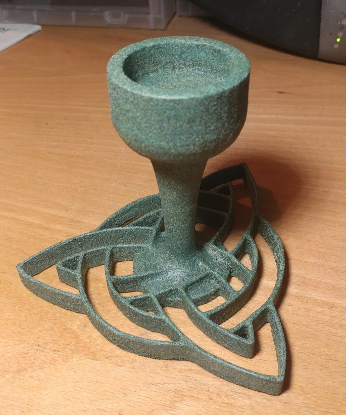

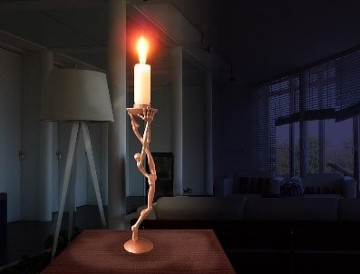
 
Svo las ég verkefnið ögn betur og ákvað þá að gera photogrammetry af bolla, sem sést á mynd hér fyrir neðan. Vonaðist ég til að hann væri ekki of glansandi til verksins þar sem ég hafði ekki málningateip við höndina. Erfiðlega reyndist að finna matta, ógegnsæja hluti í nærumhverfinu. Bollinn er 8,6 cm á hæð og einnig á þverveginn efst þar sem hann er breiðastur, þó ekki með handfanginu, með því er hann 11,5 cm um það bil. Svo hugsanlega mun það vera meira en 100g en þá ætlaði ég að freista þess að geta minnkað módelið úr raunstærð og gera hann í smækkaðri mynd. 
Fyrst tók ég einungis 36 myndir en miðað við myndbandið var tekið rúmlega 60 myndir svo ég fór á stúana og tók fleiri, blessunarlega hafði ég vit á því að skemma ekki uppsetninguna. 
Ég horfði á eftirfarandi myndband sem lýsti framkvæmd verksins vel: https://www.youtube.com/watch?v=ye-C-OOFsX8
Byrjaði ég því á að taka myndir af bollanum á litlu borðstofuborði. Sett ég klút á það því áferðin á borðplötunni var svolítið glansandi. Því næst downloadaði ég bæði Colmap og Meshlab. Tengdi svo símann við tölvuna og bjó til tvær möppur, „photos“ sem geymdi myndirnar af bollanum og „reconstruction“ sem mun halda utan um það sem kemur út úr verkinu. 
 
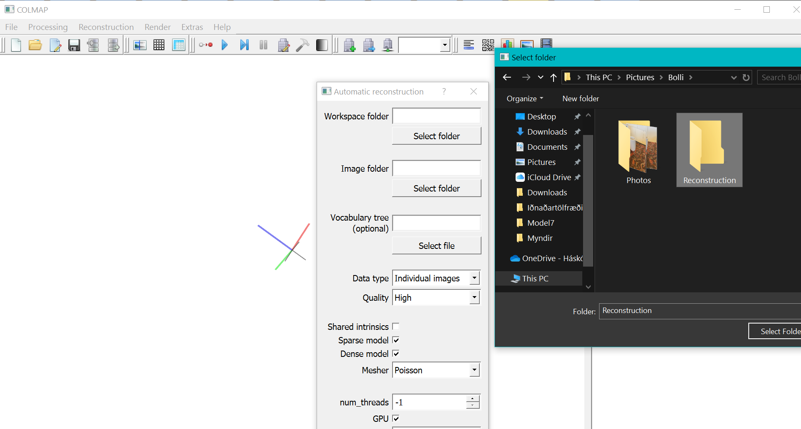

Ég valdi „Recontruction“ möppuna fyrir Workspace folder og image folder setti ég „Photos“ möppuna sem geymir allar myndirnar sem ég tók af bollanum. Valdi Quality medium. 
Ókei, nú er komið babb í bátinn. Forritið frýs alltaf þegar ég reyni að runna automatic reconstruction. Er að prófa aftur með quality low og vona það besta. Það virkar heldur ekki. Grunar að tölvan mín sé ekki með nógu gott graphic memory til verksins … prófa aðra útgáfu af forritnu.
Þetta ferli var greinilega alltof bjartsýnt. Þegar þetta var skoðað nánar var ljóst að það þarf NVIDIA skjákort sem ég á ekki. 
Kíki því á vefsetrið hans Ívars vinar míns sem ég veit að hefur náð að klára þetta verkefni á sambærilegan hátt og ég vil gera. 
Hér eru leiðbeiningarnar hans: https://ivardor.github.io/V403G_verkefni3.html
Regard3D er forritið sem hann notar. Hann vísar jafnframt í leiðbeiningar inni á síðu forritsins sem ég mun einnig nota: https://www.regard3d.org/index.php/documentation/tutorial
Jæja, þar sem myndavélin sem ég nota er einungis iPhone 11 myndavél, og ég hef ekki aðgang að betri þá fæ ég alltaf villumeldingu um að focal length sé óþekkt fyrir of margar myndir. 

Google leit heldur áfram. „3d photogrammetry without nvidia“
https://www.fosshub.com/Meshroom.html?dwl=Meshroom-2019.2.0-win64.zip Prófa Meshroom, þar sem það auglýsir sig fyrir að vera frítt og að þú þurfir ekki NVIDIA skjákort. 

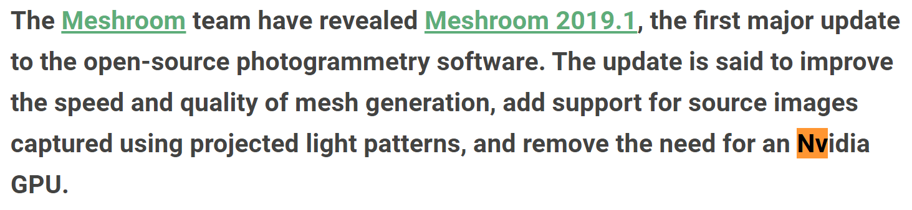

Hér er skjáskot úr þræði (https://3dcoat.com/forum/index.php?/topic/22669-meshroom-free-photogrammetry/) sem fjallar um Meshroom. Ég bind því miklar vonir við forritið! Á þessum tímapunkti hef ég eftirfarandi kröfur til þess forrits sem ég mun nota:
-	Kosti ekki.
-	Geti notað myndir sem teknar eru á iPhone 11.
-	Að ég þurfi ekki NVIDIA skjákort, eða nokkuð skjákort … ég vinn á Lenovo think pad og eyddi á sínum tíma ekki auka pening í tölvu með skjákorti (sé eftir því núna). 
https://www.youtube.com/watch?v=NdpR6k-6SHs þetta eru leiðbeiningarnar sem ég vonast til að ná að fylgja eftir. 
Eftir að hafa hlaðið inn myndunum ýti ég á „start“ takkann ofarlega fyrir miðju. Þá fer tölvan á fullt:

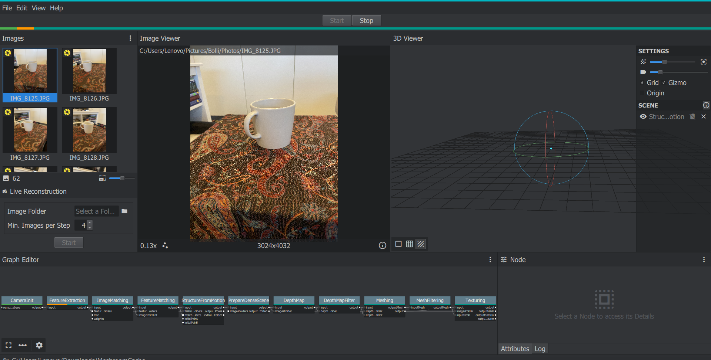

Aftur á móti sé ég ekki hversu langur tími er áætlaður að sé eftir af því að gera módelið. Sé aftur á móti hver staðan er í Graph editor. Jákvæðu fréttirnar þegar hér er komið við sögu er að forritið er ekki að hætta að svara og virðist það vera að færast áfram í vinnu sinni! Jeij! 

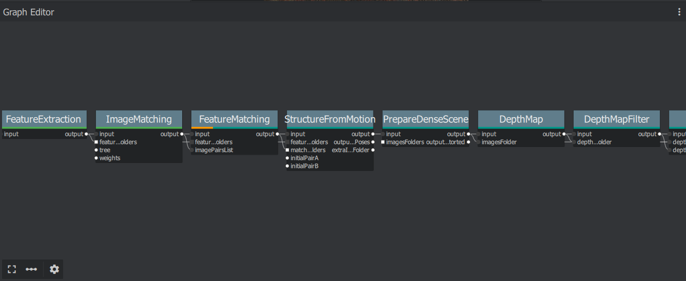

Ég fylgist með task manager og má sjá á eftirfarandi mynd að það er allt á blússandi siglingu, svo mikilli að tölvan virðist vart hafa í við! 

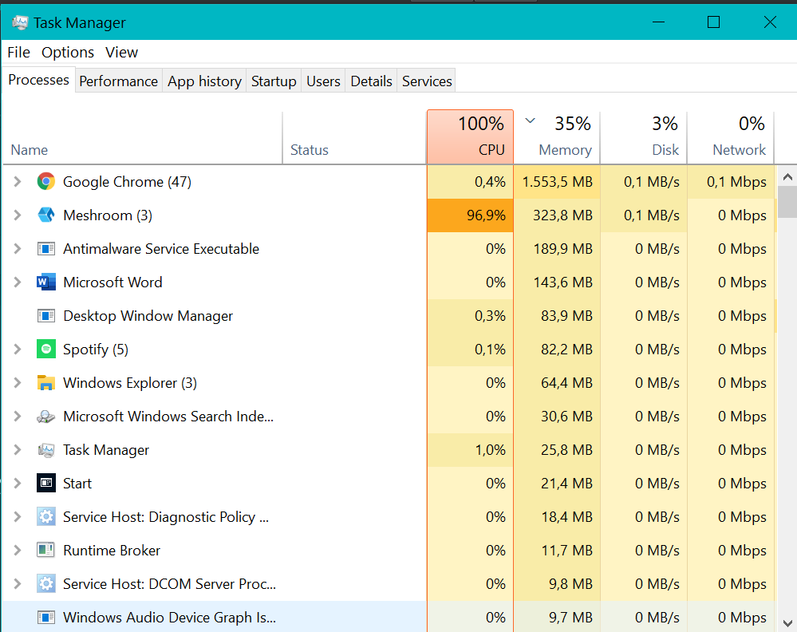
 
Nú langar höfundi þessarar greinar einna helst að bresta í grát …

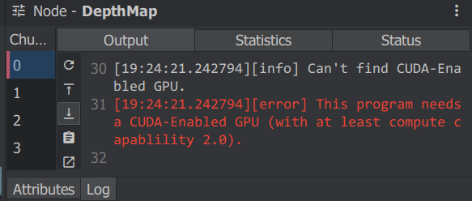
 
Þessi villumelding var að koma upp (sjá mynd hér að ofan)

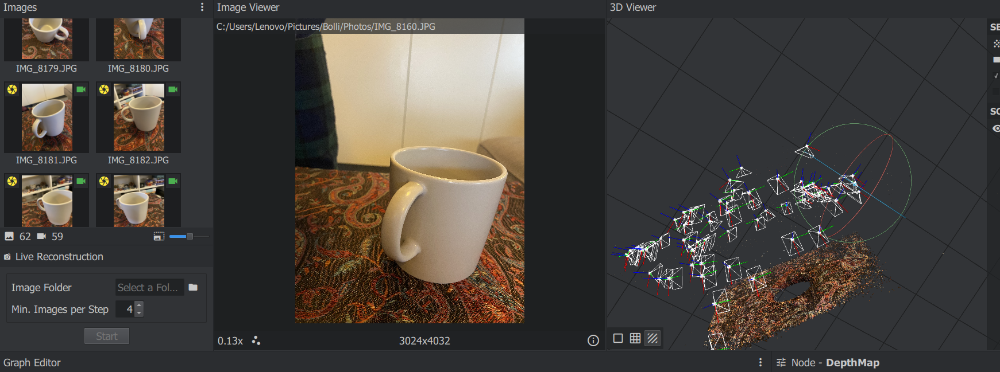

Svona líta málin út eins og staðan er núna. En við munum ekki geta haldið áfram með verkefnið í Meshroom. Það er nokkuð ljóst. 
NEI! 
Það er ekki ljóst!
https://github.com/alicevision/meshroom/wiki/Draft-Meshing
Hér segir að við getum einfaldlega eitt þremur hnúðum sem þurfa NVIDIA. Þá þurfum við líka að breyta stillingum fyrir FeatureExtraction frá Normal í High. Og byrjum aftur að rendera verkefnið. Líkt og sést á myndinni fyrir ofan náðist ekki 3D módel af bollanum heldur bara 2D af klútnum sem ég notaði undir til að vera með grunn. Sjáum hvort bollinn birtist eftir þessar breytingar (væntingum hér er stillt í hóf svo lítið sé sagt). 

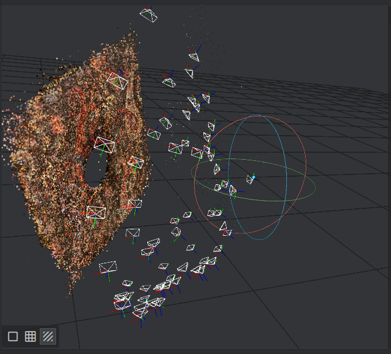
 
Jæja, þá er lokaniðurstaða komin í hús og verkefniseigandi glimrandi ánægð með niðurstöðuna.
Djók.
Ég tel mig vita hverjir vankantarnir eru, í fyrsta lagi er engin áferð á könnunni og í öðru lagi er undirlagið of hrjúft. Því er taka tvo með nýjum hlut. 
Taka tvö í bígerð. Haldið ykkur fast. 

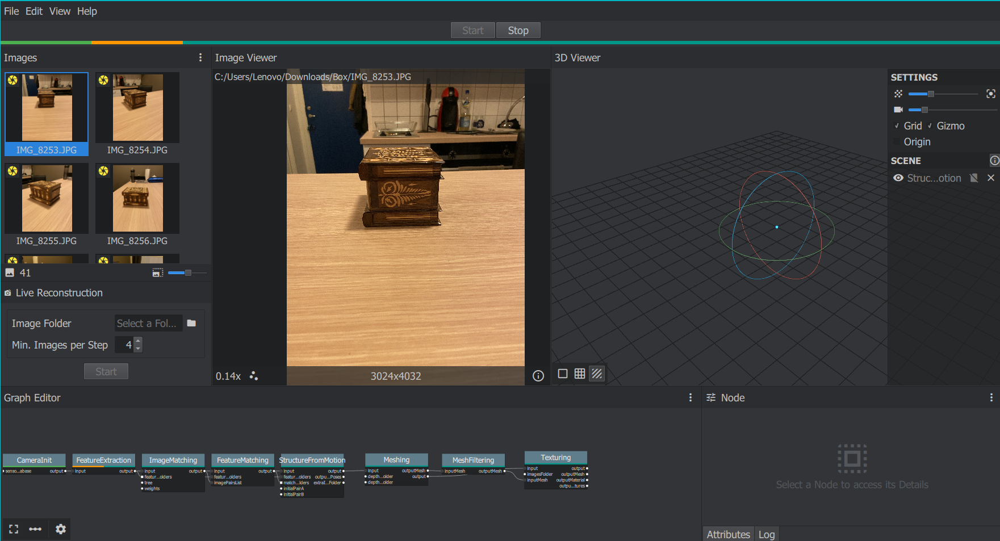

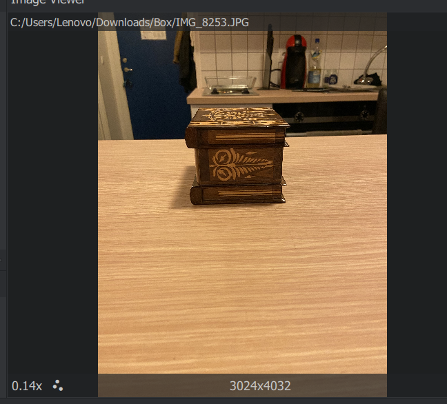
 
Aftur á móti þegar hingað er komið í ferlinu, kannski tæplega hálfnað að bíða eftir að það vinni, er ég farin að efast um gæði myndanna, og hvort ég hefði átt að taka myndir nær kassanum. Það verður að ráðast hvort þetta dugi til. 

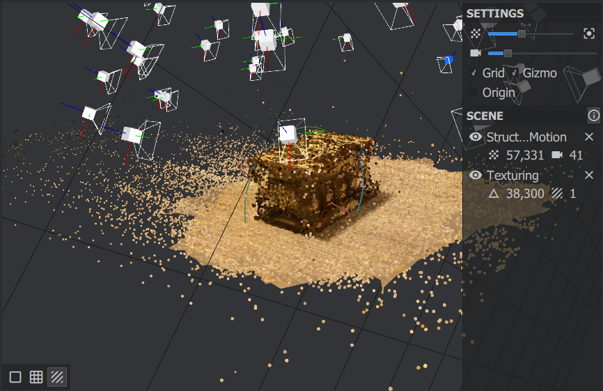

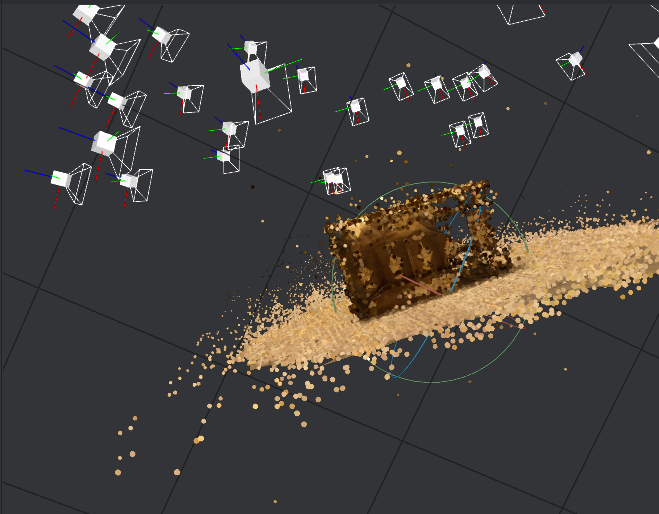
 
Jæja, hér er lokaniðurstaða úr þessari prófun.
Tími sem fór í verkefnið: 8,5 klst. (enn sem komið er). 

Hluti verkefnisins er að 3D prenta líka, en þar sem fablab er lokað læt ég mér nægja í bili að gera módel. Ég hef ákveðið að gera lyklakippu með merki dauðadjásnanna úr Harry Potter. 

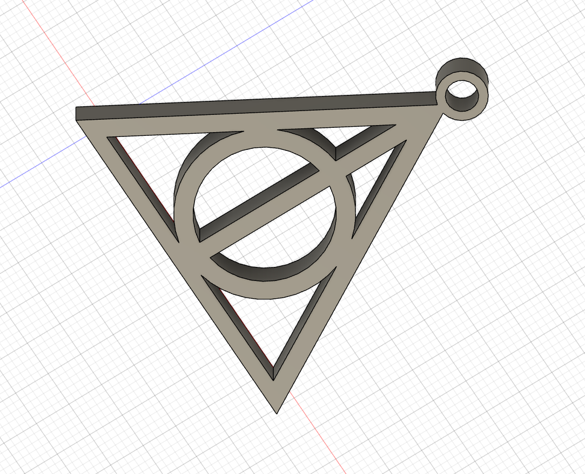
 
Ýti á make -> 3D eða álíka.
 
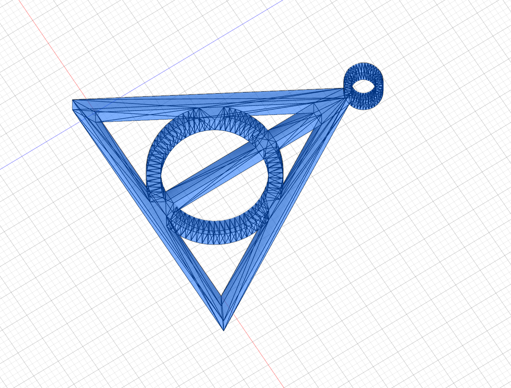 
 
Downloada meshmixer svo. Fæ hlutinn upp í meshmixer en er samt ekki alveg nógu viss hvort þetta sé nógu margir þríhyrningar í módelinu og ætla því að kynna mér það. Les eftirfarandi grein:
https://formlabs.com/blog/fusion-360-tutorial-basics-and-tips-for-3d-printing/ og þessa líka https://formlabs.com/blog/fdm-vs-sla-vs-sls-how-to-choose-the-right-3d-printing-technology/
Ég hætti við að grauta eitthvað í stillingunum, refinement er medium í það heila svo held að það ætti að vera í lagi. 
Downloadaði Cura Ultimaker. Verkið er 4g og tekur um klst að prenta. 

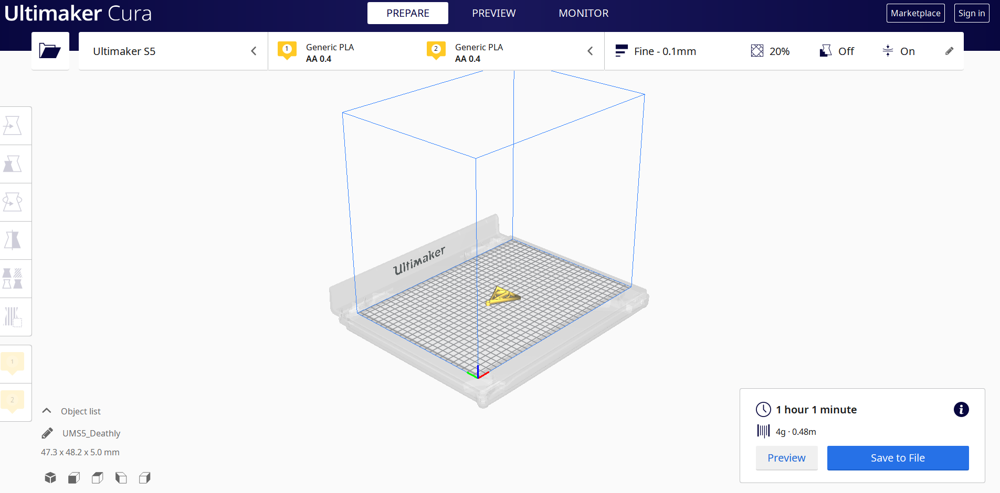
 
Tími sem fór í þennan hluta verkefnisins 1,5 klst.
